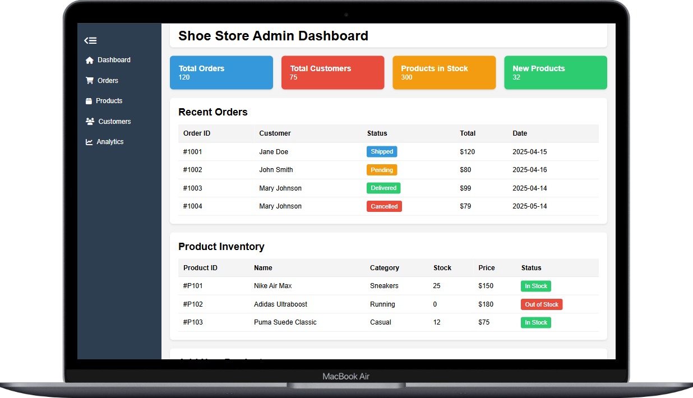

# Responsive Admin Dashboard UI

A responsive Responsive Admin Dashboard UI featuring a reponsive toggleable sidebar, data tables, data charts and add item form.

---

## Live Demo

<a href="https://github.com/paulmagadi/responsive-admin-dashboard-mock-UI" style="padding: 11px 20px; background-color: red;
color: white; font-weight: 600; border-radius: 5px;" target="-blank">Live Demo</a>

## 🖼️ Screenshots

  

---

## 🚀 Features

✅ **Toggleable Sidebar**   
✅ **Preview Cards** with quantity tracking  
✅ **Data Tables** 
✅ **Dynamic Data Charts**  
✅ **Responsive Navigation**  

---

## 📂 Folder Structure

```
responsive-admin-dashboard-mock-UI/
│
├── index.html
├── styles.css
├── scripts.js
├── screenshots.png
├── README.md
└── LICENCE
```

## 📱 Responsive Design
This website adjusts seamlessly to:

✅ Mobile Phones

✅ Tablets

✅ Desktop Screens

It uses flexbox, grid, and media queries for responsiveness.

## 🔧 Tech Stack
- HTML5 – Markup
- CSS3 – Styles & layout
- Vanilla JavaScript – DOM manipulation & logic
- Font Awesome – Icons

## 🔮 Roadmap
- User login mockup
- Backend (Django / Firebase) integration (optional future upgrade)
- Pages

## 📦 Installation

```
git clone https://github.com/paulmagadi/responsive-admin-dashboard-mock-UI.git
cd responsive-admin-dashboard-mock-UI
```

open `index.html`

No build tools required — just open in your browser.

## ✍️ Author
Paul Magadi

👨‍💻 Software Developer & UI/UX Enthusiast

🌐 [Portfolio](https://paulmagadi.github.io) 

🐙 [GitHub](https://github.com/paulmagadi)

🔗 [LinkedIn](https://www.linkedin.com/in/paulmagadi)

## 📄 License
This project is licensed under the MIT License.

